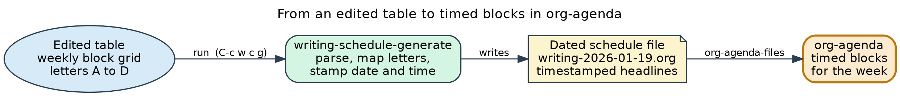
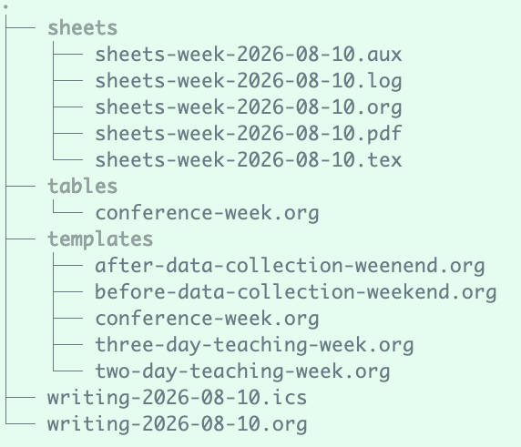
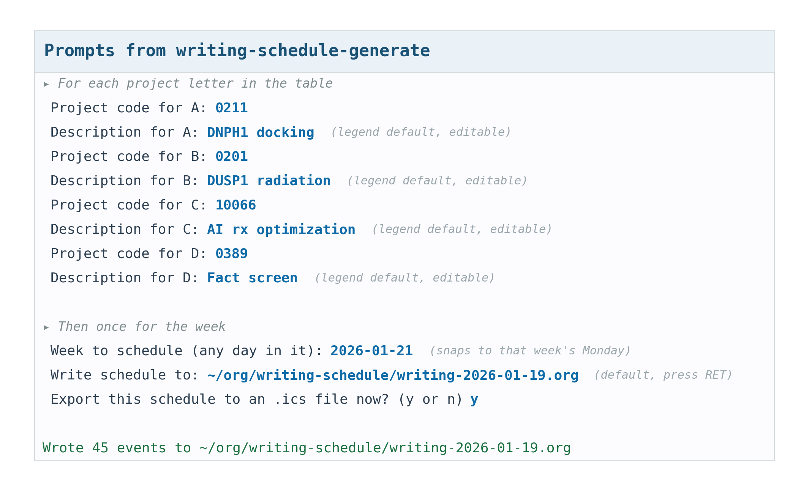

# writing-schedule.el

Turn a weekly writing-block table into org agenda events and an iCalendar
file you can import into Outlook Web or any calendar application. Run from
inside Emacs for use with org-agenda, or for non-Emacs users, from the
shell with a bash script for use with iCal, Google Calendar, or Outlook
Calendar. Originally
designed to schedule writing, but it can be used for any recurring
activity, like writing code, working on email, yard work, exercising,
buying groceries, and so on. Rare events are best added manually to the
calendar.


You keep a weekly plan as an org table. Each row is a time block, each
column after the first is a day, and each filled cell holds a short
uppercase code that names the project or task worked on during that
block, for example A, B, or a two-letter task code such as EM for email.
A table can hold many codes, so it is not limited to four projects. This
package reads that table and writes a schedule file of dated events.
Those events feed the org agenda, and org's own iCalendar exporter turns
them into a file that Outlook Web or any calendar application can import.

The table is a seating chart. You decide who sits where, meaning which
project fills which block. The generator is the usher that walks the
chart, stamps each seat with a real date and time, and hands the guest
list to your calendar.



*The pipeline: an edited table becomes a dated schedule file of
timestamped headlines, which org-agenda shows as the week's timed
blocks.*

## Features

- Insert a blank template for up to 26 projects, or use your own short uppercase codes.
- Print two-page time-block sheets for a week, with the plan in the first column and blank columns for revisions.
- Parse a filled table into dated, timed org events.
- Prompt for a project code and description per letter, with legend rows
  supplying the defaults.
- Total the weekly hours for each letter in a summary section.
- Keep a library of context templates, and start any week from one in a keystroke.
- Include a command-line script, so people who do not use Emacs can list templates and generate a calendar file.
- Archive each week in its own dated file, such as `writing-2026-01-19.org`.
- Feed the org agenda, optionally as TODO items.
- Export to iCalendar with stable identifiers, so re-imports update
  events rather than duplicating them.
- No external dependencies for normal use. Only Emacs and the built-in
  `org` and `ox-icalendar` libraries are required.

## Related work

[org-timeblock](https://github.com/ichernyshovvv/org-timeblock) gives org-agenda
an interactive timeblock view of scheduled tasks. writing-schedule.el is
complementary: it generates and archives a week from a reusable template and
exports it to iCalendar, rather than viewing timestamps that already exist, so
the two pair well.

## Requirements

- Emacs 27.1 or later.
- Org mode 9.3 or later (bundled with recent Emacs).
- Optional, for coverage and linting only: `undercover`, `package-lint`,
  and the system tools `lcov` and `genhtml`.

## Project layout

```
writing-schedule.el                        The package.
writing-schedule.sh                        Command-line front end for non-Emacs users.
writing-schedule-3-example.org             A filled three-project table.
examples/three-projects.org                An example template to copy into your templates dir.
examples/projects-and-tasks.org            An example mixing projects and two-letter task codes.
writing-schedule/                          Archive directory of dated weekly files.
  templates/                               Saved context templates (filled tables).
  tables/                                  This week's working table, copied from a template.
  sheets/                                  Printable time-block sheets (LaTeX and PDF).
Makefile                                   Test, coverage, and lint targets.
test/
  test-writing-schedule.el                 Unit tests.
  test-writing-schedule-integration.el     Integration tests.
doc/
  writing-schedule.texi                    Texinfo manual.
imgs/                                      Figures used in this README.
README.md                                  This file.
```

## Installation

Place `writing-schedule.el` on your load path and require it.

```elisp
(add-to-list 'load-path "~/path/to/writing-schedule")
(require 'writing-schedule)

;; Where the weeks are archived.
(setq writing-schedule-directory "~/org/writing-schedule/")

;; A timezone string keeps exported events anchored correctly.
(setq org-icalendar-timezone "America/Chicago")
```

The template and table directories default to `templates/` and `tables/` under
`writing-schedule-directory`, computed each time they are used, so setting the
base directory is enough and the load order does not matter. Set
`writing-schedule-template-directory` or `writing-schedule-table-directory` only
when you want templates or working tables somewhere else.



*Where files live. Each week is archived as its own dated `.org` schedule
with a matching `.ics`. Your filled tables sit in `templates/`, and the
week you are working on is copied into `tables/`.*

## Running the package: a tutorial

### 1. Insert a template

Open a scratch org buffer and run:

```
M-x writing-schedule-insert-template
```

Answer the prompt with the number of projects for the week. A blank
table appears with the default time blocks and one legend row per
project.

### 2. Fill the table

Type a code into each day cell to assign a project or task to that block.
Leave a cell empty to skip that block on that day. The table looks like
this once filled.

```
| Time <l>    | M | Tu | W | Th | F | Sa |
|-------------+---+----+---+----+---+----|
| Generative: |   |    |   |    |   |    |
| 04:00-05:30 | A | B  | A | B  | B |    |
| 05:45-07:15 | A | B  | A | B  | B | B  |
|-------------+---+----+---+----+---+----|
| A: docking  |   |    |   |    |   |    |
| B: radiation|   |    |   |    |   |    |
```

Put a short project description in the first column of each legend row,
after the code and colon, for example a first cell of `A: docking`. That
description becomes the event title. The parser tolerates irregular
spacing and single-digit hours, so `9:15 - 10:45`, `04:00-5:30`, and even
`15:00-16: 30` all work, and a lower-case cell code is normalized to
upper case.

A code is not limited to a single letter, and a table is not limited to
four projects. Any short uppercase code works, so you can mix projects
with recurring tasks, for example `EM` for email, `EX` for exercise, or
`W` for your daily words. Uppercase is what marks a code, because a
capitalized word such as `Generative` is read as a section header rather
than a code. See `examples/projects-and-tasks.org` for a week that mixes
projects and two-letter task codes.

### 3. Generate the schedule

Put point anywhere inside the table and run:

```
M-x writing-schedule-generate
```

For each letter you are asked for a project code and a description. If
you typed a description into a legend row, it becomes the default. Then
you pick any day inside the target week, and the command snaps back to
that week's Monday. The command writes a dated file for that week, such as
`writing-2026-01-19.org`, inside `writing-schedule-directory`. It then
adds the file to your agenda and offers to export the iCalendar file.
Each following week lands in its own file, so past weeks are archived
rather than overwritten.



*The prompt sequence, with sample responses. The description default
comes from the legend row, and the agenda step is automatic, because it
is controlled by `writing-schedule-add-to-agenda` rather than a prompt.*

### 4. Sync a calendar

Run `M-x writing-schedule-export-ics`, or from the shell
`writing-schedule.sh export`, to write the `.ics` file, then import it
into any calendar application. Because each headline carries a stable
identifier, importing an edited week updates the matching events rather
than duplicating them. The steps for the three common calendars follow.

**Apple Calendar (macOS or iOS).** Choose **File > Import...**, select the
`.ics` file, then pick a calendar.

**Outlook on the web.** Choose **Add calendar** then **Upload from file**,
and select the `.ics` file.

**Google Calendar.**

1. Open Google Calendar in your web browser.
2. In the top right corner, click the Settings menu (the gear icon) and select **Settings**.
3. In the left-hand sidebar, click **Import & export**.
4. Click on **Select file from your computer** and select the `.ics` file you want to upload.
5. Choose which calendar you want to add the imported events to using the **Add to calendar** dropdown menu.
6. Click **Import**.

Note: If you want to keep these events separate from your main schedule,
it is highly recommended to create a new secondary calendar (for example,
named "Writing") first, and then select that calendar during the import
step. This makes it easy to toggle the schedule on and off or delete the
events in bulk if you need to re-generate the week. Apple Calendar, Google
Calendar, and Outlook all support secondary calendars.

### 5. Browse the archive

Because every week is its own dated file, you can reopen any of them.

```
M-x writing-schedule-open-week
```

This lists the archived weeks with completion, newest first, so a recent
week is one keystroke away. With a prefix argument, `C-u
M-x writing-schedule-open-week`, you instead pick any day from the date
prompt and the command opens the file for the week that contains it. To
jump straight to the latest week, run `M-x writing-schedule-open-recent`.

### 6. Start a week from a saved template

Keep a library of filled tables in `writing-schedule-template-directory`,
one per context, for example `teaching-week.org`, `grant-deadline.org`,
or `writing-retreat.org`. Each already has the letters assigned, so the
weekly half hour of deciding where each project goes is done once. If your
tables live in `~/org/writing-schedule/table`, point the library there with
`(setq writing-schedule-template-directory "~/org/writing-schedule/table/")`,
or use the default `templates/` subdirectory.

```
M-x writing-schedule-new-week-from-template
```

Choose a template. The command copies it to this week's working table in
`writing-schedule-table-directory`, opens that copy, and puts point in
the table so you can adjust a few letters and run
`writing-schedule-generate` right away. Because the copy is separate from
the template, your library stays intact.

If a saved table already matches the coming week and you do not need to
edit it, generate from it in one step:

```
M-x writing-schedule-generate-from-template
```

This lists your saved tables, and after you pick one it generates the
dated schedule of events for the org agenda directly, prompting for the
project mapping and the week. It reads the table without changing it.

To keep a table you have customized for a particular kind of week, put
point in the table and run:

```
M-x writing-schedule-save-template-table
```

It prompts for a name and writes the table to your template directory, so
it joins the library for later use.

### 7. Print a time-block sheet

A schedule is a plan, and a plan meets a day of interruptions and
opportunities. Printable time-block sheets let the plan bend without
breaking. Put point in the table and run:

```
M-x writing-schedule-timeblock-sheets
```

Choose the week, then choose one PDF for the whole week or one PDF per
day. Each day becomes a two-page sheet. The code key runs across the top,
the day's planned blocks fill the first column, and the columns to its
right stay blank.

You print the sheet and carry it. The first column is the plan you made
at the start of the week. When the day changes, meaning an interruption
or an opportunity arrives, you write the revised plan in the second
column at the point of change. A later change goes in the third column,
and another in the fourth. The sheet thus records not only the plan but
how the day actually unfolded, so disruption makes the record richer
rather than poorer. That is the antifragile part, because the schedule
gains from the very changes that would derail a rigid plan.

The sheets are written to a `sheets/` subdirectory and compiled to PDF
when `pdflatex` is available. Otherwise the LaTeX files are left for you
to compile. The hours, the number of columns, and the sheet directory are
all customizable.

### Feeding the agenda

Add your task file, the schedule file, and any project logs to the agenda
so all three become sources of TODO items and timed blocks.

```elisp
(setq org-agenda-files
      '("~/org/tasks.org"
        "~/org/writing-schedule/"   ; the archive directory picks up every dated week
        "~/org/logs/"))
```

## Commands

| Command                            | Purpose                                          |
|------------------------------------|--------------------------------------------------|
| `writing-schedule-insert-template` | Insert a blank table for up to 26 projects        |
| `writing-schedule-generate`        | Parse the table at point and write the org file  |
| `writing-schedule-export-ics`      | Export the org file to an `.ics` file            |
| `writing-schedule-add-to-agenda`   | Add the generated file to `org-agenda-files`     |
| `writing-schedule-open-week`       | Open an archived week by completion, newest first, or by date with a prefix argument |
| `writing-schedule-open-recent`     | Open the most recent archived week               |
| `writing-schedule-new-week-from-template` | Copy a saved template into this week and open it, ready to generate |
| `writing-schedule-generate-from-template` | Select a saved table and generate the schedule from it directly |
| `writing-schedule-save-template-table`          | Save the edited table at point as a named template |
| `writing-schedule-timeblock-sheets`             | Print two-page time-block sheets for the week      |

## Key bindings

The package ships a prefix keymap, `writing-schedule-command-map`, that
puts the commands on single keys: `g` generate, `t` template, `n` new
week from template, `f` generate from a saved table, `s` save table as template, `b`
time-block sheets, `o` open
week, `r` open recent, `e` export ics, and `a` add to agenda. Bind it
under any prefix you like. When `C-c w` is already your writing prefix,
nest it on a free key such as `c`.

```elisp
(with-eval-after-load 'writing-schedule
  (keymap-set my-writing-prefix "c" writing-schedule-command-map))
```

With `use-package`, the same nesting loads the package on first use and
adds which-key labels.

```elisp
(use-package writing-schedule
  :load-path "~/src/writing-schedule"
  :bind-keymap ("C-c w c" . writing-schedule-command-map)
  :config
  (when (fboundp 'which-key-add-key-based-replacements)
    (which-key-add-key-based-replacements
      "C-c w c"   "writing-schedule"
      "C-c w c g" "generate week"
      "C-c w c t" "insert template"
      "C-c w c n" "new week from template"
      "C-c w c f" "generate from table"
      "C-c w c s" "save table as template"
      "C-c w c b" "time-block sheets"
      "C-c w c o" "open week"
      "C-c w c r" "open recent"
      "C-c w c e" "export ics"
      "C-c w c a" "add to agenda")))
```

After that, `C-c w c r` opens the most recent week, and `C-c w c o` opens
a week by completion or, with a prefix argument, by date.

### With straight.el

If you manage packages with `straight.el`, choose one of the two forms
below. Do not combine `:load-path` with a straight recipe, because they
are two different ways to locate the package and they conflict. In both
forms the settings sit in `:init` so they apply before the first `C-c w
c` press, because `:bind-keymap` defers loading until you use the prefix.

A local checkout that you edit yourself. Opt out of straight with
`:straight nil` and load from your directory. This is the right choice
while you are developing the package.

```elisp
(use-package writing-schedule
  :straight nil
  :load-path "~/src/writing-schedule"
  :bind-keymap ("C-c w c" . writing-schedule-command-map)
  :init
  (setq writing-schedule-directory "~/org/writing-schedule/")
  (setq org-icalendar-timezone "America/Chicago"))
```

Managed by straight from a published repository. Drop `:load-path` and
give straight a git recipe (adjust the host and repo to yours).

```elisp
(use-package writing-schedule
  :straight (writing-schedule :type git :host github :repo "MooersLab/writing-schedule")
  :bind-keymap ("C-c w c" . writing-schedule-command-map)
  :init
  (setq writing-schedule-directory "~/org/writing-schedule/")
  (setq org-icalendar-timezone "America/Chicago"))
```

## For non-Emacs users (command line)

You do not need to know Emacs to get a calendar from a template. The
`writing-schedule.sh` script uses Emacs only as an engine, and it mirrors
the package's capabilities, producing an iCalendar (`.ics`) file that you can
import into Apple Calendar, Google Calendar, or Outlook Calendar.


*The shell path: an edited table becomes an iCalendar file, which you
import into Apple Calendar, Google Calendar, or Outlook as the week's timed blocks. It
parallels the Emacs flow shown in the introduction.*

The commands are:

```
./writing-schedule.sh list                       # list the templates
./writing-schedule.sh weeks                      # list archived weeks, newest first
./writing-schedule.sh template 4                 # print a blank 4-project template
./writing-schedule.sh template 4 heavy.org       # or write it to a file
./writing-schedule.sh generate three-projects 2026-01-21   # table + date -> schedule + .ics
./writing-schedule.sh export writing-2026-01-19.org        # re-export a schedule to .ics
./writing-schedule.sh sheets three-projects 2026-01-21     # printable time-block sheets (add --per-day)
./writing-schedule.sh save heavy.org grant-week  # save a table file into the library
./writing-schedule.sh deps                       # check that Emacs is available
./writing-schedule.sh help
```

A typical first run scaffolds a template, edits it in any text editor, then
generates the week:

```
./writing-schedule.sh template 3 ~/org/writing-schedule/templates/teaching.org
# edit teaching.org, fill each day cell with a letter, describe each in the legend
./writing-schedule.sh generate teaching 2026-01-21
```

The `generate` and `export` commands print the path of the `.ics` file.
To import it into Apple Calendar, Google Calendar, or Outlook, follow the
steps under [Sync a calendar](#4-sync-a-calendar) above.

Configure paths through the environment:

```
WS_DIR            directory holding writing-schedule.el (default: the script's dir)
WS_OUT_DIR        output directory (default: ~/org/writing-schedule)
WS_TEMPLATE_DIR   templates directory (default: WS_OUT_DIR/templates)
WS_TABLE_DIR      working-table directory (default: WS_OUT_DIR/tables)
WS_TIMEZONE       iCalendar timezone, for example America/Chicago (default: local)
```

Set `WS_OUT_DIR` alone and the templates and tables directories follow it.
Override `WS_TEMPLATE_DIR` or `WS_TABLE_DIR` only to place them elsewhere.

Check dependencies. The script needs only Emacs, because org and ox-icalendar
are built in:

```
./writing-schedule.sh deps
```

An example template is in `examples/three-projects.org`. Copy it into your
templates directory to get started:

```
mkdir -p ~/org/writing-schedule/templates
cp examples/three-projects.org ~/org/writing-schedule/templates/
```

For nicer calendar titles, fill the legend rows of a template with a short
description per letter, because those descriptions become the event titles.

## Testing

### Prerequisites

Running the tests needs only Emacs, because both ERT and the required org
libraries are built in. Coverage and linting need extra tools, installed
with a single target described below.

### Quick start

Run the whole suite from the project root.

```
make test
```

The Makefile finds the tests whether they live in a `test/` subdirectory
or beside the Makefile in a single flat directory. If you keep them
somewhere else, point the Makefile at that directory with
`make test TEST_DIR=path/to/tests`.

### Available make targets

| Target              | Purpose                                          |
|---------------------|--------------------------------------------------|
| `make test`         | Run all tests, unit and integration              |
| `make test-unit`    | Run unit tests only                              |
| `make test-integration` | Run integration tests only                   |
| `make compile`      | Byte-compile the source with warnings as errors  |
| `make lint`         | Run package-lint on the source                   |
| `make checkdoc`     | Check documentation strings                      |
| `make coverage`     | Run tests with a text coverage report            |
| `make coverage-html`| Generate an HTML coverage report in `htmlcov/`   |
| `make coverage-check` | Fail if line coverage is below 90 percent      |
| `make clean`        | Remove byte-compiled and coverage artifacts      |
| `make install-test-deps` | Install undercover and package-lint         |
| `make help`         | Print the target list                            |

### Running a single test

Run one test file, or a single test by name, directly with Emacs.

```bash
# One file.
emacs --batch -L . -L test \
  -l test/test-writing-schedule.el \
  -f ert-run-tests-batch-and-exit

# One test by an exact-name regexp.
emacs --batch -L . -L test \
  -l test/test-writing-schedule.el \
  --eval '(ert-run-tests-batch-and-exit "writing-schedule/parse-time/happy-path")'
```

### Coverage

Install the coverage and lint tools once, then generate a report.

```
make install-test-deps
make coverage
```

These package-based targets run a bare `emacs --batch`, which by default
uses `~/.emacs.d` and its `elpa` store. If your Emacs user directory is
elsewhere, set `EMACS_DIR` so the targets reuse your installed packages
(Emacs 29 or later is required for this).

```
make coverage EMACS_DIR=~/e30fewpackages
```

For an HTML report, run `make coverage-html` and open `htmlcov/index.html`.
The current suite reports 100 percent line coverage across 93 tests. The
`make coverage-check` target fails the build if coverage falls below 90
percent, which suits a continuous-integration gate.

### Writing new tests

Unit tests live in `test/test-writing-schedule.el` and cover the pure
helper functions. Integration tests live in
`test/test-writing-schedule-integration.el` and exercise the full path
through a live org buffer, the interactive commands, and the iCalendar
export. Name a test `writing-schedule/<function>/<behavior>` so its
intent is clear from the report. Tag every integration test with
`:tags '(integration)` so the `test-integration` target can select it.
Use `make-temp-file` and `unwind-protect` for anything that touches the
file system, and stub interactive prompts such as `read-string` and
`org-read-date` with `cl-letf` so the tests run without input.

### Continuous integration

The Makefile targets are pipeline friendly and can be called from any CI
system. A minimal GitHub Actions job looks like this.

```yaml
name: tests
on: [push, pull_request]
jobs:
  ert:
    runs-on: ubuntu-latest
    steps:
      - uses: actions/checkout@v4
      - uses: purcell/setup-emacs@master
        with:
          version: '29.3'
      - run: make install-test-deps
      - run: make test
      - run: make coverage-check
```

## Documentation

A Texinfo manual is in `doc/writing-schedule.texi`. Build the Info and
HTML versions with:

```bash
makeinfo --no-split doc/writing-schedule.texi        # Info
makeinfo --html --no-split doc/writing-schedule.texi # HTML
```

## License

GPL-3.0-or-later.
